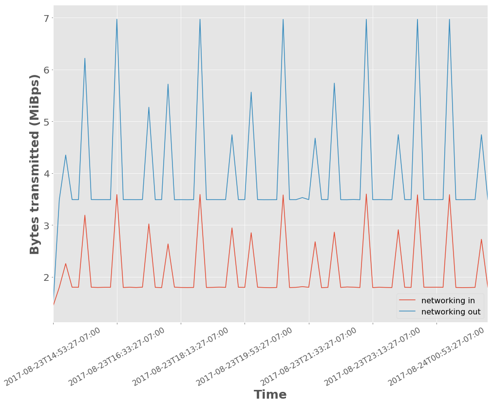

..
  Technote content.

  See https://developer.lsst.io/docs/rst_styleguide.html
  for a guide to reStructuredText writing.

  Do not put the title, authors or other metadata in this document;
  those are automatically added.

  Use the following syntax for sections:

  Sections
  ========

  and

  Subsections
  -----------

  and

  Subsubsections
  ^^^^^^^^^^^^^^

  To add images, add the image file (png, svg or jpeg preferred) to the
  _static/ directory. The reST syntax for adding the image is

  .. figure:: /_static/filename.ext
     :name: fig-label
     :target: http://target.link/url

     Caption text.

   Run: ``make html`` and ``open _build/html/index.html`` to preview your work.
   See the README at https://github.com/lsst-sqre/lsst-technote-bootstrap or
   this repo's README for more info.

   Feel free to delete this instructional comment.

:tocdepth: 1
.. Please do not modify tocdepth; will be fixed when a new Sphinx theme is shipped.

.. note::

   **This technote is not yet published.**

Abstract
========

The Large Synoptic Survey Telescope (LSST) plans to produce a live stream of its detections of transient astronomical events within 60 seconds of observation at an expected rate of about 10,000 alerts per visit and 10 million per night.
According to the VOEvent database archived by 4piSky, existing technology supports a current alert stream rate of \~43,000 per month.
Additionally, the LSST alerts are expected to be significantly larger in size than past alerts given the plan to include cutout "postage stamp" images with each alert event packet.
In anticipation of supporting an alert stream unprecedented in size and velocity, we are experimenting with streaming technology that is used at large scale outside of astronomy that may be suitable for our use case.
Here we benchmark the performance of an alert distribution testbed using this streaming technology.

Introduction
============

Technology Suite
================

For alert distribution, serialization, and filtering, we are testing primarily three open source technologies supported by the Apache ecosystem: Kafka, Avro, and Spark.

Kafka
-----
For alert distribution, we are testing `Apache Kafka <https://kafka.apache.org>`__.
Kafka is a logging system or messaging queue reinvented as a distributed streaming platform.
It is highly-scalable and used in production at companies like LinkedIn, Netflix, and Microsoft to process over a trillion messages per day.
Originally out of LinkedIn, the development of Kafka is supported by the company Confluent, which also provides an ecosystem of tools around Kafka.
The Kafka ecosystem has well-supported clients in a number of languages including C/C++ and Python.

Avro
----
For alert formatting, we are using `Apache Avro <https://avro.apache.org>`__.
Avro is a data serialization system similar to Thrift or Protocol Buffers that provides more structure to data than XML or JSON.
Avro uses schemas, similar to a CREATE TABLE SQL database statement, defined with JSON to describe data structures and data types.
Postage stamp cutout files can be included in alert packets as ``bytes`` type.

Spark
-----
For alert filtering, we are experimenting with `Apache Spark <http://spark.apache.org>`__.
Spark is a computing platform in the Hadoop ecosystem for big data.
The key relevant feature for this work is Spark Streaming, which allows a simple way to write streaming applications in way similar to tradition batch jobs.
Spark Streaming allows for alert filters to be written in simple familiar Python.
The initial benchmarking results here do not include filtering with Spark, but we mention it here for because of its fit in the choices for the overall ecosystem.

Benchmarking Experiments
============================

To construct a testbed, we built a containerized suite of simple alert "producers" and "consumers" that serializes an example alert event and talks to a Kafka broker.

Tooling
-------
The main testbed of alert consumers and producers to Kafka can be found in the `lsst-dm organization's "alert_stream" GitHub repo <https://github.com/lsst-dm/alert_stream>`__.
This repo provides instructions for a Docker build and a Dockerized deployment of Kafka and Zookeeper from the Confluent Platform version 3.2.0.
The example alert data and schemas for Avro serialization are pulled into the main Docker image and can be found in `lsst-dm organization's "sample-avro-alert" GitHub repo <https://github.com/lsst-dm/sample-avro-alert>`__, including postage stamp cutout files in FITS format.
Examples of how to use Spark Streaming with Avro and Kafka can be found in the `lsst-dm organizations's "filtering-blueprints" GitHub repo <https://github.com/lsst-dm/filtering-blueprints>`__.

For monitoring the ecosystem deployment with Docker Swarm, we used `"swarmprom" <https://github.com/stefanprodan/swarmprom>`__, a monitoring suite for Docker Swarm that uses Prometheus, Grafana, cAdvisor, Node Exporter and Alert Manager.

Initial Benchmark
-----------------
As a first benchmark, we deployed one Kafka broker and one Zookeeper listening to a single alert producer serializing and sending 1,000 alerts (~rate expected from the Zwicky Transient Facility) repeatedly every 39 seconds with two alert consumers on the receiving end of the alerts for 1000 visits or 1 million total alerts.

The system was run on Amazon's Web Services (AWS) using the `Docker for AWS <https://docs.docker.com/docker-for-aws/>`__ CloudFormation `Template <https://editions-us-east-1.s3.amazonaws.com/aws/stable/Docker.tmpl>`__.
The Docker Swarm size was set to a cluster of 3 Swarm managers and 5 Swarm worker nodes.
All managers and workers were set to r3.xlarge EC2 HVM instance size with 200 GiB standard ephemeral storage.
The r3.xlarge flavor is a memory optimized flavor with 4 vCPUs, 2.5 GHz, Intel Xeon E5-2670v2, and 30.5 GiB memory.

Results
^^^^^^^

For one producer generating 1000 alerts per visit x 1000 visits with two consumers (consumer1 counts all and prints every 100th alert and consumer2 just prints the latest offset from Kafka), no alerts were lost in transit.
The average time for 1000 alerts to be generated, sent to Kafka, and received by the consumer was ~4.2 seconds.

  +-----------------------------------------------+--------------------+---------------+
  |     Timing                                    | Mean +/- Stddev    |  Min-Max      |
  +===============================================+====================+===============+
  | Producer serialization and send to Kafka      |3.88 +/- 0.25 s     | 3.37 - 4.32 s |
  +-----------------------------------------------+--------------------+---------------+
  | Transit time to receipt by consumer           |0.30 +/- 0.23 s     | 0.06 - 1.05 s |
  +-----------------------------------------------+--------------------+---------------+

The following measurements were derived from observations output every 5 minutes over the ~11 hours of generating 1 million alerts.

  +-----------------------------------------------+--------------------+---------------+
  |     CPU (%)                                   | Mean +/- Stddev    |      Max      |
  +===============================================+====================+===============+
  | Kafka                                         |0.090 +/- 0.038     | 0.390         |
  +-----------------------------------------------+--------------------+---------------+
  | Zookeeper                                     |< 0.001 +/- 0.001   | 0.013         |
  +-----------------------------------------------+--------------------+---------------+
  | Producer                                      |0.239 +/- 0.064     | 0.448         |
  +-----------------------------------------------+--------------------+---------------+
  | Consumer1                                     |0.083 +/- 0.024     | 0.156         |
  +-----------------------------------------------+--------------------+---------------+
  | Consumer2                                     |0.001 +/- 0.001     | 0.006         |
  +-----------------------------------------------+--------------------+---------------+

  +-----------------------------------------------+--------------------+---------------+
  |     Memory (GiB)                              | Mean +/- Stddev    |      Max      |
  +===============================================+====================+===============+
  | Kafka                                         |26.1 +/- 6.6        | 30.6          |
  +-----------------------------------------------+--------------------+---------------+
  | Zookeeper                                     |0.08 +/- 0.01       | 0.08          |
  +-----------------------------------------------+--------------------+---------------+
  | Producer                                      |0.02 +/- 0.02       | 0.09          |
  +-----------------------------------------------+--------------------+---------------+
  | Consumer1                                     |0.009 +/- 0.0004    | 0.015         |
  +-----------------------------------------------+--------------------+---------------+
  | Consumer2                                     |0.008 +/- 0.0002    | 0.009         |
  +-----------------------------------------------+--------------------+---------------+

  +-----------------------------------------------+--------------------+---------------+
  |     Network in                                | Mean +/- Stddev    |      Max      |
  +===============================================+====================+===============+
  | Kafka                                         | 2.08 +/- 0.58 MiBps| 3.6 MiBps     |
  +-----------------------------------------------+--------------------+---------------+
  | Zookeeper                                     | 81 +/- 97 Bps      | 1.2 KiBps     |
  +-----------------------------------------------+--------------------+---------------+
  | Producer                                      |11 +/- 3.3 KiBps    | 24.8 KiBps    |
  +-----------------------------------------------+--------------------+---------------+
  | Consumer1                                     |2.05 +/- 0.59 MiBps | 3.5  MiBps    |
  +-----------------------------------------------+--------------------+---------------+
  | Consumer2                                     |2.01 +/- 0.56 MiBps | 3.5 MiBps     |
  +-----------------------------------------------+--------------------+---------------+

  +-----------------------------------------------+--------------------+---------------+
  |     Network out                               | Mean +/- Stddev    |      Max      |
  +===============================================+====================+===============+
  | Kafka                                         | 4.03 +/- 1.10 MiBps|  7.0  MiBps   |
  +-----------------------------------------------+--------------------+---------------+
  | Zookeeper                                     | 49 +/- 79 Bps      | 966 Bps       |
  +-----------------------------------------------+--------------------+---------------+
  | Producer                                      |1.97 +/- 0.54 MiBps | 3.5  MiBps    |
  +-----------------------------------------------+--------------------+---------------+
  | Consumer1                                     |23.7 +/- 6.5 KiBps  | 43.4 KiBps    |
  +-----------------------------------------------+--------------------+---------------+
  | Consumer2                                     |2.01 +/- 0.56 MiBps | 3.5 MiBps     |
  +-----------------------------------------------+--------------------+---------------+

  +-----------------------------------------------+--------------------+---------------+
  |     Cluster total IO                          | Mean +/- Stddev    |      Max      |
  +===============================================+====================+===============+
  | read                                          |1.25 +/- 4.27 KiB   |      75.2 KiB |
  +-----------------------------------------------+--------------------+---------------+
  | written                                       |2.5 +/- 3.4 MiB     |      61.0 MiB |
  +-----------------------------------------------+--------------------+---------------+

  +-----------------------------------------------+--------------------+---------------+
  |     Cluster total network traffic             | Mean +/- Stddev    |      Max      |
  +===============================================+====================+===============+
  | received                                      |6.4 +/- 1.0 MiBps   |   6.8 MiB     |
  +-----------------------------------------------+--------------------+---------------+
  | transmitted                                   |6.5 +/- 1.0 MiBps   |  6.8 MiB      |
  +-----------------------------------------------+--------------------+---------------+

The networking traffic pattern shows some burstiness seen in :numref:`figure-1`.
The bandwidth out is higher than in because this experiment has two consumers reading the full stream.

   Network traffic in and out of Kafka.
   The x-axis ticks are demarcated at time intervals of 1 hour and 40 minutes.
