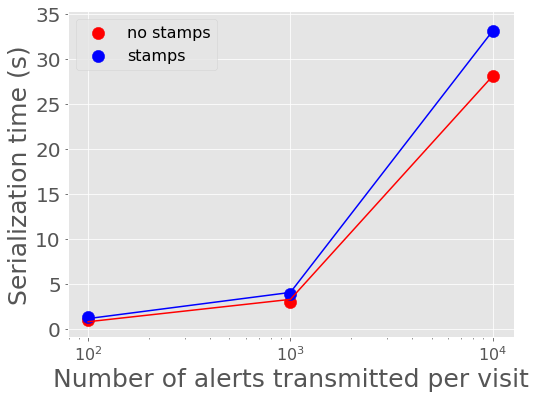
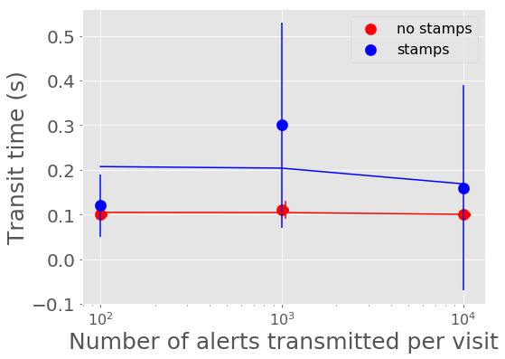
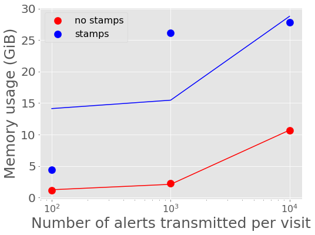
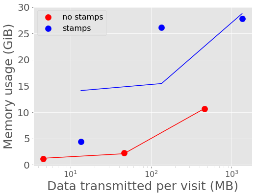
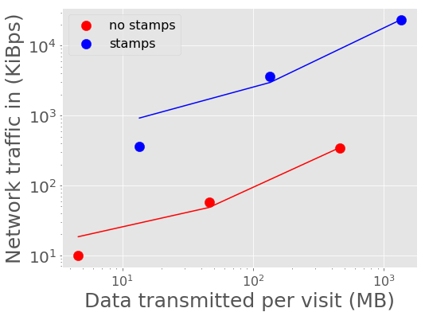
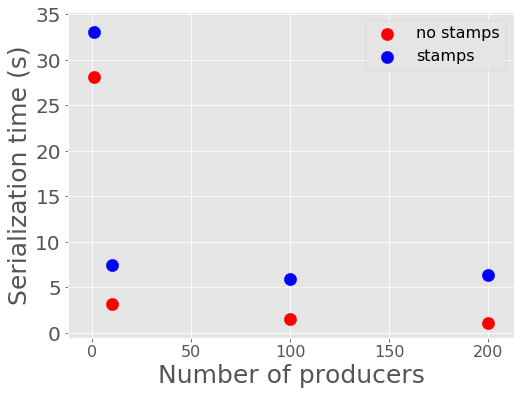
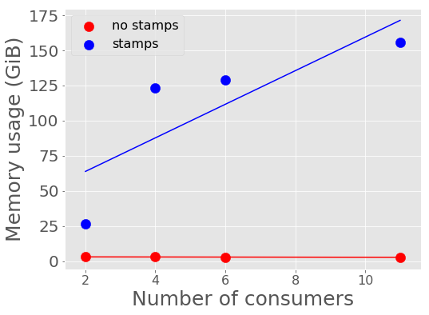

:tocdepth: 2
.. Please do not modify tocdepth; will be fixed when a new Sphinx theme is shipped.

.. note::

   **This technote is not yet published.**

Abstract
========

The Large Synoptic Survey Telescope (LSST) plans to produce a live stream of its detections of transient astronomical events within 60 seconds of observation at an expected rate of about 10,000 alerts per visit and 10 million per night.
According to the VOEvent database archived by 4piSky, existing technology supports a current alert stream rate of \~43,000 per month.
Additionally, the LSST alerts are expected to be significantly larger in size than past alerts given the plan to include cutout "postage stamp" images with each alert event packet.
In anticipation of supporting an alert stream unprecedented in size and velocity, we are experimenting with streaming technology that is used at large scale outside of astronomy that may be suitable for our use case.
Here we benchmark the performance of an alert distribution testbed using this streaming technology.

Introduction
============

Current performance requirements on the LSST alert system expect to distribute at minimum ``nAlertVisitAvg`` = 10,000 alert events every 39 seconds, with a stretch goal of supporting 100,000 per visit.
This minimum averages to ~250 alerts per second, though may be transmitted at a higher, much more bursty rate, compared to the current VOEvent rate of ~1 alert per minute.
The LSST alerts are planned to contain a significant amount of information in each alert event packet,
including individual event measurements made on the difference image, a measure of the "spuriousness" of the event,
a limited history of previous observations of the object associated with the event if known, characteristics of the variability of the object's lightcurve,
the IDs and distances to nearby known objects, and cutout images of both the difference image and the template that was subtracted.
The experiments here use a template alert event packet as described below with very limited content (e.g. no history) with a size of 136 KB, primarily dominated by the 90 KB size of the two cutout images in FITS format.
A full alert packet with all event measurements and a history of previous observations will be larger.
On the receiving end of the alert distribution system will be community brokers and a limited filtering service mini-broker.
The LSST filtering service is expected to be able to support ``numBrokerUsers`` = 100 simultaneous connected users each receiving at most ``numBrokerAlerts`` = 20 full alerts per visit.
In order to meet LSST's alert stream needs, the alert distribution system must be able to scale to support the expected volume of the alert stream, to support the number of connections, and to allow filtering capabilities that can be made user friendly with simple Python or SQL-like language.
Here we test the scalability of a preliminary mock alert distribution system testbed.

Technology Suite
================

For alert distribution, serialization, and filtering, we are testing primarily three open source technologies supported by the Apache ecosystem: Kafka, Avro, and Spark.

Kafka
-----
For alert distribution, we are testing `Apache Kafka <https://kafka.apache.org>`__.
Kafka is a logging system or messaging queue reinvented as a distributed streaming platform.
It is highly-scalable and used in production at companies like LinkedIn, Netflix, and Microsoft to process over a trillion messages per day.
Originally out of LinkedIn, the development of Kafka is supported by the company Confluent, which also provides an ecosystem of tools around Kafka.
The Kafka ecosystem has well-supported clients in a number of languages including C/C++ and Python.

Avro
----
For alert formatting, we are using `Apache Avro <https://avro.apache.org>`__.
Avro is a data serialization system similar to Thrift or Protocol Buffers that provides more structure to data than XML or JSON.
Avro uses schemas, similar to a CREATE TABLE SQL database statement, defined with JSON to describe data structures and data types.
Postage stamp cutout files can be included in alert packets as ``bytes`` type.

Spark
-----
For alert filtering, we are experimenting with `Apache Spark <http://spark.apache.org>`__.
Spark is a computing platform in the Hadoop ecosystem for big data.
The key relevant feature for this work is Spark Streaming, which allows a simple way to write streaming applications in way similar to tradition batch jobs.
Spark Streaming allows for alert filters to be written in simple familiar Python and can be natively connected to Kafka.
The initial benchmarking results here do not include filtering with Spark, but we mention it here for because of its fit in the choices for the overall ecosystem.

Benchmarking Experiments
============================

To construct a testbed, we built a containerized suite of simple alert "producers" and "consumers" that serializes an example alert event and talks to a Kafka broker.

Tooling
-------
The main testbed of alert consumers and producers to Kafka can be found in the `lsst-dm organization's "alert_stream" GitHub repo <https://github.com/lsst-dm/alert_stream>`__.
This repo provides instructions for a Docker build and a Dockerized deployment of Kafka and Zookeeper from the Confluent Platform version 3.2.0.
The example alert data and schemas for Avro serialization are pulled into the main Docker image and can be found in `lsst-dm organization's "sample-avro-alert" GitHub repo <https://github.com/lsst-dm/sample-avro-alert>`__, including postage stamp cutout files in FITS format.
Examples of how to use Spark Streaming with Avro and Kafka can be found in the `lsst-dm organizations's "filtering-blueprints" GitHub repo <https://github.com/lsst-dm/filtering-blueprints>`__.

For monitoring the ecosystem deployment with Docker Swarm, we used `"swarmprom" <https://github.com/stefanprodan/swarmprom>`__, a monitoring suite for Docker Swarm that uses Prometheus, Grafana, cAdvisor, Node Exporter and Alert Manager.

Initial Benchmark
-----------------
As a first benchmark, we deployed one Kafka broker and one Zookeeper listening to a single alert producer serializing and sending 1,000 alerts (~rate expected from the Zwicky Transient Facility) repeatedly every 39 seconds with two alert consumers on the receiving end of the alerts for 1000 visits or 1 million total alerts.
This ZTF scale test will be supplemented by larger scale tests to derive scaling curves.

The system was run on Amazon's Web Services (AWS) using the `Docker for AWS <https://docs.docker.com/docker-for-aws/>`__ CloudFormation `Template <https://editions-us-east-1.s3.amazonaws.com/aws/stable/Docker.tmpl>`__.
The Docker Swarm size was set to a cluster of 3 Swarm managers and 5 Swarm worker nodes.
All managers and workers were set to r3.xlarge EC2 HVM instance size with 200 GiB standard ephemeral storage.
The r3.xlarge flavor is a memory optimized flavor with 4 vCPUs, 2.5 GHz, Intel Xeon E5-2670v2, and 30.5 GiB memory.

Results
^^^^^^^

For one producer generating 1000 alerts per visit x 1000 visits with two consumers (consumer1 counts all and prints every 100th alert and consumer2 just prints the latest offset from Kafka), no alerts were lost in transit.
The average time for 1000 alerts to be generated, sent to Kafka, and received by the consumer was ~4.2 seconds.

  +-----------------------------------------------+--------------------+---------------+
  |     Timing                                    | Mean +/- Stddev    |  Min-Max      |
  +===============================================+====================+===============+
  | Producer serialization and send to Kafka      |3.88 +/- 0.25 s     | 3.37 - 4.32 s |
  +-----------------------------------------------+--------------------+---------------+
  | Transit time to receipt by consumer           |0.30 +/- 0.23 s     | 0.06 - 1.05 s |
  +-----------------------------------------------+--------------------+---------------+

The following measurements were derived from observations output every 5 minutes over the ~11 hours of generating 1 million alerts.

  +-----------------------------------------------+--------------------+---------------+
  |     CPU (%)                                   | Mean +/- Stddev    |      Max      |
  +===============================================+====================+===============+
  | Kafka                                         | 9.0 +/- 3.8        |  39.0         |
  +-----------------------------------------------+--------------------+---------------+
  | Zookeeper                                     |< 0.1 +/- 0.1       |   1.3         |
  +-----------------------------------------------+--------------------+---------------+
  | Producer                                      | 23.9 +/- 6.4       |  44.8         |
  +-----------------------------------------------+--------------------+---------------+
  | Consumer1                                     | 8.3 +/-  2.4       |  15.6         |
  +-----------------------------------------------+--------------------+---------------+
  | Consumer2                                     | 0.1 +/- 0.1        |   0.6         |
  +-----------------------------------------------+--------------------+---------------+

  +-----------------------------------------------+--------------------+---------------+
  |     Memory (GiB)                              | Mean +/- Stddev    |      Max      |
  +===============================================+====================+===============+
  | Kafka                                         |26.1 +/- 6.6        | 30.6          |
  +-----------------------------------------------+--------------------+---------------+
  | Zookeeper                                     |0.08 +/- 0.01       | 0.08          |
  +-----------------------------------------------+--------------------+---------------+
  | Producer                                      |0.02 +/- 0.02       | 0.09          |
  +-----------------------------------------------+--------------------+---------------+
  | Consumer1                                     |0.009 +/- 0.0004    | 0.015         |
  +-----------------------------------------------+--------------------+---------------+
  | Consumer2                                     |0.008 +/- 0.0002    | 0.009         |
  +-----------------------------------------------+--------------------+---------------+

  +-----------------------------------------------+--------------------+---------------+
  |     Network in                                | Mean +/- Stddev    |      Max      |
  +===============================================+====================+===============+
  | Kafka                                         | 2.08 +/- 0.58 MiBps| 3.6 MiBps     |
  +-----------------------------------------------+--------------------+---------------+
  | Zookeeper                                     | 81 +/- 97 Bps      | 1.2 KiBps     |
  +-----------------------------------------------+--------------------+---------------+
  | Producer                                      |11 +/- 3.3 KiBps    | 24.8 KiBps    |
  +-----------------------------------------------+--------------------+---------------+
  | Consumer1                                     |2.05 +/- 0.59 MiBps | 3.5  MiBps    |
  +-----------------------------------------------+--------------------+---------------+
  | Consumer2                                     |2.01 +/- 0.56 MiBps | 3.5 MiBps     |
  +-----------------------------------------------+--------------------+---------------+

  +-----------------------------------------------+--------------------+---------------+
  |     Network out                               | Mean +/- Stddev    |      Max      |
  +===============================================+====================+===============+
  | Kafka                                         | 4.03 +/- 1.10 MiBps|  7.0  MiBps   |
  +-----------------------------------------------+--------------------+---------------+
  | Zookeeper                                     | 49 +/- 79 Bps      | 966 Bps       |
  +-----------------------------------------------+--------------------+---------------+
  | Producer                                      |1.97 +/- 0.54 MiBps | 3.5  MiBps    |
  +-----------------------------------------------+--------------------+---------------+
  | Consumer1                                     |23.7 +/- 6.5 KiBps  | 43.4 KiBps    |
  +-----------------------------------------------+--------------------+---------------+
  | Consumer2                                     |2.01 +/- 0.56 MiBps | 3.5 MiBps     |
  +-----------------------------------------------+--------------------+---------------+

  +-----------------------------------------------+--------------------+---------------+
  |     Cluster total IO                          | Mean +/- Stddev    |      Max      |
  +===============================================+====================+===============+
  | read                                          |1.25 +/- 4.27 KiB   |      75.2 KiB |
  +-----------------------------------------------+--------------------+---------------+
  | written                                       |2.5 +/- 3.4 MiB     |      61.0 MiB |
  +-----------------------------------------------+--------------------+---------------+

  +-----------------------------------------------+--------------------+---------------+
  |     Cluster total network traffic             | Mean +/- Stddev    |      Max      |
  +===============================================+====================+===============+
  | received                                      |6.4 +/- 1.0 MiBps   |   6.8 MiB     |
  +-----------------------------------------------+--------------------+---------------+
  | transmitted                                   |6.5 +/- 1.0 MiBps   |  6.8 MiB      |
  +-----------------------------------------------+--------------------+---------------+

The networking traffic pattern shows some burstiness seen in :numref:`figure-1`.
The bandwidth out is higher than in because this experiment has two consumers reading the full stream.

   Network traffic in and out of Kafka.
   The x-axis ticks are demarcated at time intervals of 1 hour and 40 minutes.

Scaling Alert Volume
--------------------
To complement the initial benchmarking experiment at ZTF scale and derive scaling curves, we ran several similar tests varying the total number of alerts produced per visit.
We set the alert producer to serialize and produce 100, 1,000, and 10,000 alerts per visit and
also ran each of those tests once including and once without including the postage stamp cutout files in the alert packets to further vary the volume of data sent per visit.
The tests use the same testbed setup as the initial benchmark experiment, using Docker for AWS as described above,
with again 3 Swarm managers and 5 Swarm worker nodes on r3.xlarge machines.
For the larger experiments, we increased the instance ephemeral storage to the maximum of 1 TiB.

Results
^^^^^^^
Given the results from the initial benchmark, the most interesting metrics or where the Kakfa system uses a significant amount of resources are
the timing metrics for serialization and for transportation of alerts, memory usage for Kafka, and network traffic in and out of the Kafka system.

In :numref:`figure-2` and :numref:`figure-3`, we show the mean time it takes to serialize into Avro format and send a batch of alerts to Kafka.
100 alerts takes about 1 second to serialize and send to Kafka, 1,000 alerts takes about 3-4 seconds, and 10,000 alerts takes about 28-33 seconds for a single producer.
A single producer then can serialize about 300 alerts into Avro per second.

   Alert serialization time vs number of alerts in a batch with best fit linear relations overplotted.

   Alert serialization time vs volume of alerts with best fit linear relations overplotted.

:numref:`figure-4` and :numref:`figure-5` show the mean time it takes for the last alert in a batch produced to be sent through Kafka and received by a consumer.
For all experiments, the transport time is low, between 0.10 - 0.30 seconds.
The time spent serializing alerts into Avro format on the producer end dominates over the transport time.

   Alert transit time vs number of alerts in a batch with best fit linear relations overplotted.

   Alert transit time vs volume of alerts with best fit linear relations overplotted.

:numref:`figure-6` and :numref:`figure-7` show the average memory usage by Kafka over the length of each experiment.
A back-of-the-envelope calculation for estimating memory needs says that if you want Kafka to buffer for 30 seconds then
the memory need is write_throughput*30.  If we say on average the alert throughput is at least 250 alerts/second
(but really bursty and likely higher) then the memory estimate is 250 alerts/sec * 135 KB/alert * 30 seconds = 10+ Gigabytes.
Memory usage increases more rapidly with data volume for the larger single alert size (including postage stamps),
nearing the maximum for the compute instance size for 1,000 and 10,000 alerts per visit with stamps.

   Kafka memory usage vs number of alerts in a batch with best fit linear relations overplotted.

   Kafka memory usage vs volume of alerts with best fit linear relations overplotted.

:numref:`figure-8` - :numref:`figure-11` show the peak network traffic in and out of the Kafka broker.
For 10,000 alerts, the alert producer creates a peak of 23 MiBps into Kafka,
and the two consumers double the network traffic out at 45 MiBps.

   Network traffic into Kafka vs number of alerts in a batch with best fit linear relations overplotted.

   Network traffic into Kafka vs volume of data in a batch with best fit linear relations overplotted.

.. figure:: _static/netOutAlerts.png
   :width: 55%
   :align: center
   :name: figure-10

   Network traffic out of Kafka vs number of alerts in a batch with best fit linear relations overplotted.

   Network traffic out of Kafka vs volume of data in a batch with best fit linear relations overplotted.

Scaling Alert Producers
-----------------------
We ran several simulations increasing the total number of alert producers, holding all else constant,
again with two consumers, one consumer counting and printing every 100th alert and one consumer used for the timestamps
which prints only the latest offset upon reaching the end of the topic's partition (i.e., when there are no more alerts to read.)
We tested 1, 10, 100, and 200 alert producers serializing and producing in total 10,000 alerts per visit
(e.g., 200 alert producers each producing 50 alerts.)
Assuming 189 CCDs for LSST and a unit of pipeline compute parallelization per CCD,
the experiment with 200 producers each producing 50 alerts is most similar to what we might expect in practice.
We also ran each of those tests once including and once without including the postage stamp cutout files in the alert packets.
The tests use a similar testbed setup as the initial benchmark experiment, using Docker for AWS as described above,
but with 3 Swarm managers and 10 or 15 Swarm worker nodes on r3.xlarge machines to allow for the additional producer containers.

Results
^^^^^^^
For the performance metrics measured for the Kafka container, particularly memory and network traffic in and out,
there is no significant difference between the values for a single alert producer producing 10,000 alerts per visit and an increased number of producers.
Increasing the number of producers does make a measurable difference for the time to serialize 10,000 alerts and for end-to-end transport time.

   Alert serialization time vs number of producers serializing a total of 10,000 alerts.

The time to serialize and send alerts to Kafka decreases with the number of producers,
essentially a reflection of the parallelization of the task with a small additional overhead.
One producer serializing 100 alerts takes 1.29 +/- 0.06 seconds, whereas 100 producers serializing and
sending 100 alerts each to Kafka takes 5.9 +/- 1.3 seconds.

   Alert transit time vs number of producers with best fit lines overplotted.

The transit time between when a visit of alerts is finished sending to Kafka and when a consumer has finished reading to the end of the topic's partition
increases significantly with additional producers for the simulations which include postage stamp cutouts in the alert packets.
For one alert producer with and without stamps and for all simulations without stamps, the transit time is less than 1 second.
For 200 producers with 50 alerts each with stamps, the average transit time for a visit of alerts increases to 22.6 seconds.
Because of the difference between experiments including stamps and excluding stamps, there may be a configuration change necessary
that is related to the average message size.
One potential configuration parameter to experiment with tuning is the producer ``batch.size``, which has a default size of 16384 bytes,
smaller than a single alert message.

Scaling Alert Consumers
-----------------------
In testing an increased numbers of consumers, we encountered issues with the default Kafka settings and a single
producer producing 10,000 alerts.  The increased of number of consumers slowed the producer's submission of
alerts to the Kafka queue so much as to lag behind the 39 second pause between bursts of alerts from sequential
visits.  Instead of a single producer, we used 10 producers each producing 1,000 alerts, and we increased the
Java heap size of Kafka to 8 GB.  We also used a more powerful AWS cluster for our Docker Swarm.
We used 3 Swarm managers on m4.16xlarge instances (64 vCPUs, 256 GiB memory, and 10,000 Mbps EBS bandwidth)
and 10 worker nodes on m4.4xlarge instances (16 vCPUs, 64 GiB memory, and 2000 Mbps EBS bandwidth) all with
1 TiB of ephemeral storage.  When initiating Kafka and the alert stream component containers, we made sure
to constrain the Kafka container to its own node and separate the other containers to different nodes so as
not to have Kafka competing with other containers for resources.  With these settings, the lagged producer
problem is resolved.  In practice for the expected LSST alert distribution system in production, this will
likely not be a problem since there should be one producer per CCD, with the planned compute parallelization
of the pipeline.

Results
^^^^^^^
For scale testing of consumers, we performed four different tests, one with two consumers, one with
four, one with six, and one with eleven.  In each test, all but used one consumer processes the stream
by printing every 100th alert and the remaining consumer reads the stream and just drops the messages.
Each of the four tests were run both with postage stamps and without, for a total of eight tests.

Below shows the memory utilization of Kafka with an increased number of consumers and larger allotted
instances on AWS.

   Kafka container memory utilization against number of consumers.

For the 1+1 consumer test, instances were only allotted 32 GB of memory.  The other tests had 256 GiB memory
available and utilize more memory.  Tests with stamps included in alerts are significantly more memory
intensive for Kafka than tests without including postage stamps cutouts.

For these tests there is no difference for the network traffic into Kafka, as we are still sending 10,000 alerts
in each visit burst.  The network traffic out of Kafka increases linearly with more consumers, as expected,
up to 180000 KiBps (180 Mbps) for 10+1 consumers, since each consumer pulls its own stream.

   Network traffic out of Kafka against number of consumers.

Below shows the length of time it takes for producers to serialize alerts into Avro and produce to the Kafka
broker.  Having more consumers has a small impact on the producer time.
For the 1+1 consumer test, we used only one producer sending 10,000 alerts (unparallelized), which is
why the time is slightly higher.  For the other three tests, the serialization and producing time increases
slightly and linearly to 9 seconds.  With more producers producing in parallel (one per CCD),
this number would likely be lower.

   Serialization and Kafka submission time for producers against number of consumers.

The transit time of alerts, the time it takes for alerts to be read by the consumers after they have been
submitted into the Kafka queue, increases with number of consumers.  Below shows the relationship between
the transit time and number of consumers.

   Transit time of alerts to consumers against number of consumers.

For the test with 10+1 consumers including postage stamp cutouts, the average transit time is very large.
The consumers are unable to keep up with bursts of alerts every 39 seconds.  Below shows the transit time lag
increasing for alert bursts for 300 visits.

   Length of time from Kafka to consumer receipt and processing in seconds (y axis) vs. visit number (x axis).

Fortunately, even with the very slow consumer read time, the producer submission time does not appear to be
affected.

Thoughts and Recommendations
----------------------------
For most experiments and metrics measured, assuming that the size of alerts has been estimated accurately,
there is a significant impact on Kafka compute utilization and
timing when postage stamp cutouts are included in the alert packets.  Additional consideration should be
given to alternatives for the distribution of stamps, if possible.  One alternative to including postage
stamps in the stream, recommended by other users of Kafka for large messages, is to forego including the
stamps in the stream and instead include a url to the location of the stamps from which the stamp can be
accessed separately.  This would particularly alleviate the increased network traffic for each additional
consumer reading a stream.  Another potentially possible alternative could be to separate the postage stamps
into their own Kafka topic.  If not all primary consumers are required or expected to read postage stamp
cutouts and pass them to downstream users, this could decrease the total network traffic, since not all
consumers would pull from the larger stream of stamps.  A downstream filter could then unite alerts of interest
with corresponding stamps.  The feasibility of this option for combining streams still needs to be further investigated.

It is unclear why an increased number of consumers would significantly slow a single producer as to be unable
to keep up with the 39 second separation between bursts.  With larger instance sizes, there should be no bottleneck
in reading from disk and no bottleneck in the total network traffic.  Though the parallelization of compute per CCD, i.e.,
an increased number of producers in parallel, should eliminate this problem, there is the possibility of
performance improvement if this issue can be addressed.  Preliminary testing indicates that adjusting three
parameters, ``buffer.memory``, ``batch.size``, and ``linger.ms``, together may help.  Using multiple partitions
may also help.  All tests above use a single partition for a single topic.

It is also unclear why the consumers consumption time is slowed for the case of 10+1 consumers reading a stream
with stamps.  The consumer consumption time is outside the total alert production pipeline time for the alerts
to be accessible from Kafka, and a slow consumer can have additional processing while reading the stream that
can slow the process, but the transit and consumption time should still be considered.  Consumer reading of the
stream can easily be parallelized for faster processing.  The parallelization is controlled by the number of
topic partitions, so increasing the number of partitions can decrease consumer read time such that consumers
do not lag behind bursts if the consumers read in consumer groups in parallel.  For the critical time from
producer serialization into Avro and submission to Kafka, the time it takes for the alert distribution to get
alerts into the queue and ready to be read by consumers can be expected to be about 6-9 seconds when stamps
are included and 1-3 seconds without stamps.
